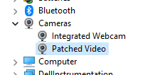
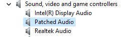
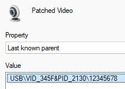
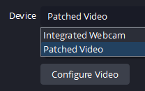

# ms21xx-firmware

Tool to generate ms21xx firmware with custom VID, PID, EDID, descriptors and serial number

## TODOs

- Support MS2109

## Installation

You can install the package via pip:

```
pip install ms21xx-firmware
```

## Usage

```
ms21xx-firmware -h
usage: generate.py [-h] [--chip {ms2109,ms2130}] [--output OUTPUT] [--vid VID] [--pid PID] [--firmware-version FIRMWARE_VERSION] [--video VIDEO] [--audio AUDIO] [--edid EDID] [--serial SERIAL]

options:
  -h, --help            show this help message and exit
  --chip {ms2109,ms2130}
  --output OUTPUT
  --vid VID
  --pid PID
  --firmware-version FIRMWARE_VERSION
  --video VIDEO
  --audio AUDIO
  --edid EDID
  --serial SERIAL
```

## Tutorial

1. Generate a firmware file using the generator tool. If you have multiple devices, make sure to use unique serial number so that OS can properly identify the devices.
   ```
   ms21xx-firmware --chip ms2130 --vid 345f --pid 2130 --firmware-version 12345678 --video "Patched Video" --audio "Patched Audio" --edid 00ffffffffffff00215730210a663401311f0103803c2278022895a7554ea3260f50542108008100814081806ec09500a9c0d1c00100023a801871382d40582c4500c48e2100001e011d007251d01e206e28550055502100001e000000fd0017551e641e000a202020202020000000fc0048444d4920544f205553420a20015402032f715401020304101112131e223e4b454c5f6421223c3d230907078301000067030c000000003ce50e616066658c0ad08a20e02d10103e9600c48e210000188c0ad090204031200c405500c48e210000184e1f008051001e3040803700c48e21000018000000000000000000000000000000000000000000000000000072 --serial 12345678 --output output.bin
   ```
1. Connect your ms21xx device to your PC.
1. Use MS21XX&91XXDownloadTool or ms-tools to patch the firmware to your device.
1. Disconnect and reconnect your device.
1. Verify if your device is properly patched.

   - Video Name

     

   - Audio Name

     

   - VID, PID, Serial Number

     

   - OBS

     

## Useful Links

- https://github.com/sandbox-pokhara/ms21xx-firmware-research
- https://mega.nz/file/HfpAnIzB#UY7eqQpnL4wJM2C5Lne6Y_5GpIF37_AqLIG4hosE0sk
- https://github.com/BertoldVdb/ms-tools
- https://www.entechtaiwan.com/util/moninfo.shtm

## License

This project is licensed under the terms of the MIT license.
